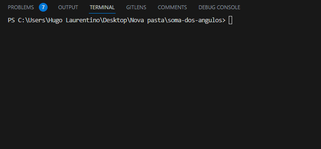

<h1 align="center">
  
</h1>

- [x] Bak-End
- [x] Criar Título
- [x] Criar Descrição
- [x] Sobre
- [x] Tecnologia
- [x] Pre requisito
- [x] Autor
- [x] GIF‘s
---
<h1 align='center'>Soma dos ângulos internos de um polígono</h1>

<p align='center'>Esse é um exemplo de lógica em javascript</p>
<p align='justify'>

Este e um programa que a partir de um polígono soma todos os lados
</p>

<p align='center'>
	<a href='#sobre'>Sobre</a> |
	<a href='#pré-requisitos'>Pre Requisitos</a> |
	<a href='#tecnologias'>Tecnologias</a> |
	<a href='#autor'>Autor</a>
</p>

---
<h1 align='center'>
	
</h1>

---
### Sobre
  <p align= 'justify'>
  A partir do número de lados de um polígono, imprima na tela a soma dos seus ângulos internos

  conforme a fórmula abaixo:

$$ S = (n - 2) \ * 180 $$

Onde:

**S:** soma dos ângulos internos do polígono \
**n:** número de lados do polígono

Em seguida, calcule quanto vale cada um desses ângulos, caso eles sejam todos iguais, utilizando a fórmula abaixo:

$$ a = \frac{S}{n} $$

Sendo:

**a:** o valor de cada ângulo em graus

  </p>


---
### Pré-requisitos 

Antes de começar, você vai precisar ter instalado em sua máquina as seguintes FERRAMENTAS: [GIT](https://git-scm.com/), [Node.js](https://nodejs.org/en/download). 
Além disto é bom ter um editor para trabalhar com o código como [VSCode](https://code.visualstudio.com/download).

### 🎲 Rodando o Back End

```bash
# Clone este repositório
$ git clone https://github.com/hugolaurentino/soma-dos-angulos.git

# Acesse a pasta do projeto no terminal/cmd
$ cd soma-dos-angulos

# Instale as dependências
$ npm install

# Execute 
$ node .\soma-dos-angulos.js

```
### Tecnologias 

As seguintes ferramentas foram usadas na construção do projeto:

- [Node.js][nodejs]
---

###### tags: `lógica` `matemática` `nodeJS`

## Autor

Feito com ❤️ por Hugo Laurentino 👋🏽 [Entre em contato!](https://www.linkedin.com/in/hugo-laurentino-silva/)

[nodejs]: https://nodejs.org/

